```{r setup, include=FALSE}
knitr::opts_chunk$set(fig.pos = 'H')
```

```{r packages, echo=FALSE, warning=FALSE, include=FALSE}
library(knitr)
library(rmarkdown)
library(bookdown)
library(knitcitations)
library(formatR)
library(devtools)
library(vembedr)
library(prettydoc)
library(htmltools)
library(packrat)
library(ggplot2)
library(vegan)
library(gridExtra)

## Text results
opts_chunk$set(echo = TRUE, warning = TRUE, message = TRUE, include = TRUE)

## Code decoration
opts_chunk$set(tidy = TRUE, tidy.opts = list(blank = FALSE, width.cutoff = 60), highlight = TRUE)

## Caching code
opts_chunk$set(cache = 2, cache.path = "cache/")

## Plots
opts_chunk$set(fig.path = "Figures/", dev=c('pdf', 'png'), dpi = 300)

## Locate figures as close as possible to requested position (=code)
#opts_chunk$set(fig.pos = "H")

#Generate BibTex citation file for all R packages used to produce report
knitr::write_bib(.packages(), file = 'packagesch11.bib')

```

\newpage

**Day Two**  
  
- **Application** *Using Git and GitBash*  

# Outline

The following are what will be covered in this tutorial:

- Making your research reproducible using GitHub
- Create a Repository on GitHub
- Cloning your repository from GitHub environment into your local computer
- Writing your code in R **(note that as example, the presenters have provided all data needed)**
- Collaborating on project
- Merging codes from different collaborators into one
- Cleaning up your GitHub repository
- Creating a README.md file on GitHub
- Committing your document as a GitHub page

# Introduction

The fundamental idea behind a robust, reproducible analysis is **a clean, repeatable, script-based workflow (i.e. the sequence of tasks from the start to the end of a project), linking raw data through to clean data and to final analysis outputs**. Working on GitHub will ensure that your research is fully reproducible for collaborators, and for the public.

In our previous tutorial for Git version control software, we learned the essential basic commands for using git, as well as how to work with GitHub to establish a repository and push our project to the website; and we also looked at a model GitHub page.

Now it is time to start working with GitHub using git: making changes in the project safely off to one side, and merging them back into the original project once they have proved to be correct, or at least not disastrous.

## Aim of tutorial and learning outcomes

This tutorial will teach you how to implement a version control protocol (with Git). 
By the end of this tutorial, you will be able to:

- Clone a repository from GitHub to RStudio
- Pull an existing repository from GitHub to RStudio
- Commit changes made to 'branch' or 'main/master' to GitHub
- Merge branches, and clean duplicated branches
- Best practices on GitHub and collaborating on projects

# Getting Started: Linking GitHub and RStudio

## Step 1

Before we start, you need to check if git is installed on your windows machine, for mac, it is already installed, but for windows, no! You should have installed it, but there is no harm in checking, so from RStudio, click on Terminal, and type:

```{bash, eval=FALSE, include=TRUE}
git
```

if git is already installed, you will see a window that looks like this:

```{r, echo=FALSE, fig.align="center", fig.cap="Screen capture to show that git is installed on your machine", out.width = '100%'}
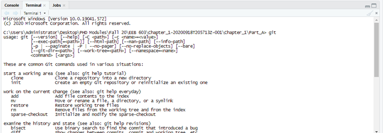
```

and you are all set! But if it isn't, you will receive this error message **('git' is not recognized as an internal or external command, operable program or batch file)**. To install git on your computer, copy this link <https://git-scm.com/downloads> into your browser, and click on "download git for windows", install git, repeat the same process as above, by opening RStudio and typing the command 'git' into your Terminal, it should now be installed.

## Step 2

Sign into your account on GitHub <https://github.com/login>, and create a new repository, name it ("practice_2_**yourinitials**"). 

```{r, echo=FALSE, fig.align="center", fig.cap="Screen capture showing how to create a repository on GitHub", out.width = '50%'}
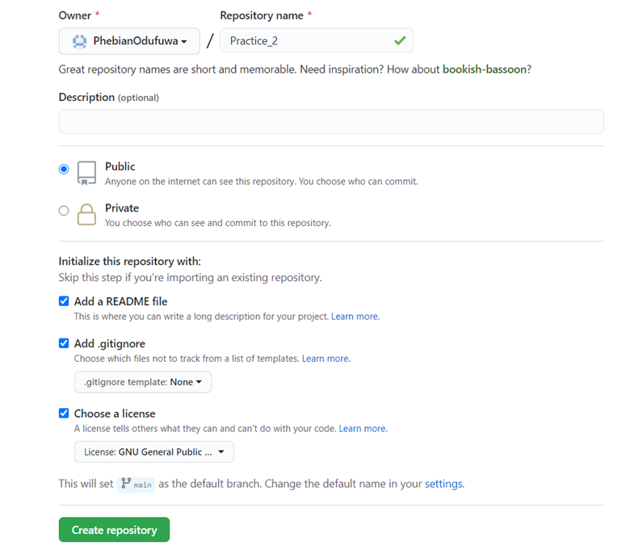
```

## Step 3

Copy the URL of the repository, open RStudio and click on **'file'**, click on **'New Project'**, from the drop-down menu, click on **'version control'** and select **'Git'**.

```{r, echo=FALSE, fig.align="center", fig.cap="Screen capture showing how to create version control on RStudio", out.width = '60%'}
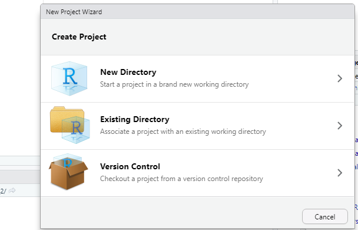
```

## Step 4

Paste the copied url, in the **'project directory name'** box, type in 'Practice_for_local_biodiversity_project_**yourinitials**', select **'open in new session'** and click on **'create project'** (see screenshot below)

```{r, echo=FALSE, fig.align="center", fig.cap="Screen capture showing how to create a GitHub project on RStudio", out.width = '60%'}
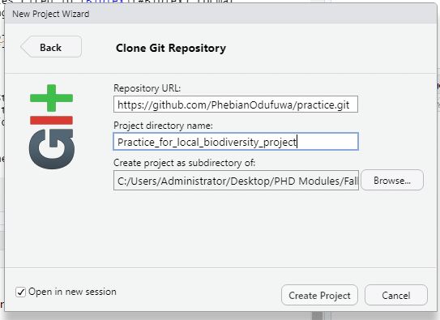
```

You should now have your repository cloned into your local computer!

\newpage

# Project: an example

**Preamble:** 

As an example for this tutorial, we are using the code written for Dr Leonora Bittleston's Advance Ecology class this semester, full permission has been taken from the course instructor, and we are permitted to use this code.

Note that the instruction for this tutorial is in the "README.md" file, but we will be doing everything hands-on in class.

See this in a practical light thus: ("you have just completed your project on  "Idaho's Local Biodiversity", you have written your code, you have your chapter written out, and you want to make it available on GitHub for your collaborators, and for the public). Let's get on with this!

## Exercise

*Instruction:* 

1. We will be doing this exercise by opening a new R Script, save the 'R Script' into the Folder where you have all your Docs stored (that is, the folder you cloned from GitHub), save your 'R script' with the name 'local_biodiv_practice_**yourinitials**'. 

2. From our Google Drive entitled **'GitTutorial_2'**, please copy the folders with the names **'Figures'**, **'Data'**, and **'Documentation.html'** and paste in your own directory where you will be working from.

3. Open our R Markdown file entitled **"Chapter_11_part_2.Rmd"**

4. Copy the code in the code chunk below, and paste in your R script. 

5. Run your code to make sure that it is working perfectly

```{r biodiversity_code, eval = FALSE, out.width='100%'}
# R code for local biodiversity project - an example

## Load the necessary packages
if (!require("ggplot2")) {install.packages("ggplot2"); require("ggplot2")}
if (!require("vegan")) {install.packages("vegan"); require("vegan")}
if (!require("gridExtra")) {install.packages("gridExtra"); require("gridExtra")}

library(vegan)
library(ggplot2)
library(gridExtra)

## Set your working directory
### setwd to source File Location

## Read in your data
dat <- read.csv("Data/Test_data_local_biodiv.csv", head = T, row.names = 1) 

### View table
dat

### Look at row and column sums
summary(rowSums(dat))
summary(colSums(dat)) 

### Most analyses will want data transposed (rows as "sites" and columns as "species")
datt <- t(dat)
  
#### Species-individual curve (optional)
dat.specaccum <- specaccum(datt, method = "rarefaction")
plot(dat.specaccum)

#### Measures of alpha diversity
dat.specnumber <- specnumber(datt) ## Number of species
dat.rowsums <- rowSums(datt!=0) ## Number of non-zero elements in each row. 
## Note that this is the same as above.
dat.shannon <- diversity(datt) ## default is Shannon diversity
dat.ens <- exp(dat.shannon) ## Effective number of species

### Combine into one table for easy graphing
dat.alpha <- cbind.data.frame(Quadrat=c(1:6),dat.specnumber,dat.shannon,dat.ens)

### This is an example of just plotting in basic R
plot(dat.alpha$Quadrat, dat.alpha$dat.specnumber)

### Make graphs in ggplot2
plot1 <- ggplot(data=dat.alpha, aes(x=Quadrat, y=dat.specnumber)) +
  geom_point()
plot2 <- ggplot(data=dat.alpha, aes(x=Quadrat, y=dat.shannon)) +
  geom_point()
plot3 <- ggplot(data=dat.alpha, aes(x=Quadrat, y=dat.ens)) +
  geom_point()

### plot the 3 graphs next to each other
grid.arrange(plot1, plot2, plot3, ncol=3)

## why do we see that a quadrant with the 2nd lowest species number 
## has the second highest effective number of species?

### Do not answer the question, as the solutions have been provided 
### in the documentation see folder entitled "Documentation.html". 
```


### Push code to GitHub

Now that you have your code written out, you should now push your code to GitHub from your local computer

#### How to do that:

- To push your code to GitHub from your local computer, you need to:

1. Click on 'Tools', 

2. Click on 'Version Control', 

3. Click on 'Commit', 

4. From the pop-up window, select what you want to add to GitHub, it is good practice to add your files individually, this will enable you to comment on each individual file. This is to ensure reproducibility, so that whoever sees those files on GitHub at first glance will be able to understand what each file does. 

So click on each individual file and type out a comment (individually), you have to do this in a succession. See the screenshots below:

```{r, , echo=FALSE, fig.align="center", out.width = '100%'}
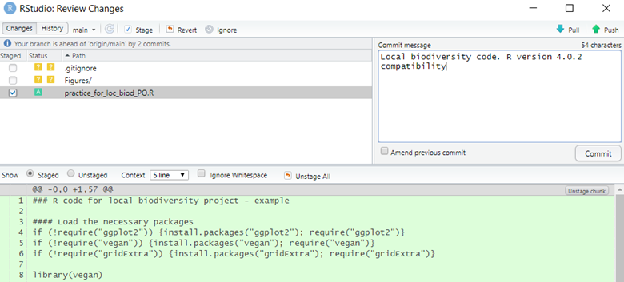
```

```{r, echo=FALSE, fig.align="center", out.width = '100%'}
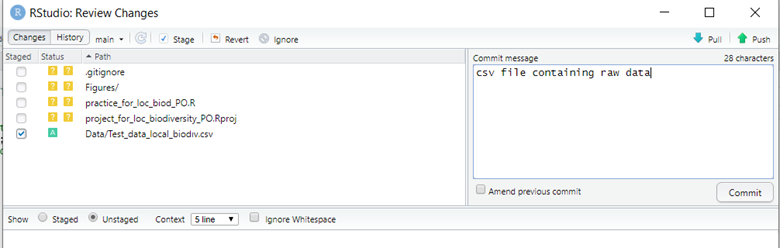
```

```{r, echo=FALSE, fig.align="center", fig.cap="Screen capture showing files with comment", out.width = '100%'}
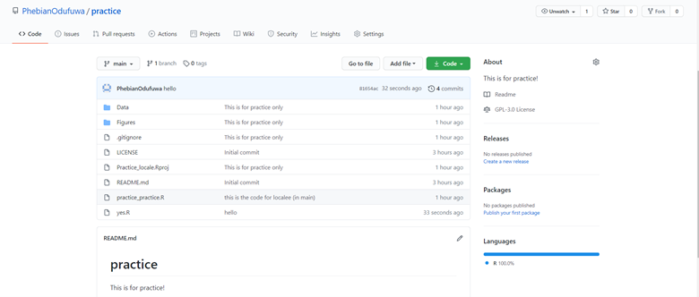
```

5. Click on 'Commit' each time

6. Once you have finished committing all changes, close the window

7. Click on 'Push' to push ALL (the commits you have made) to GitHub

8. Now check your GitHub page, refresh your GitHub page, and you will see that your repository has been populated with your new branch.

```{r, echo=FALSE, fig.align="center", fig.cap="Screen capture showing branch committed to GitHub", out.width = '100%'}
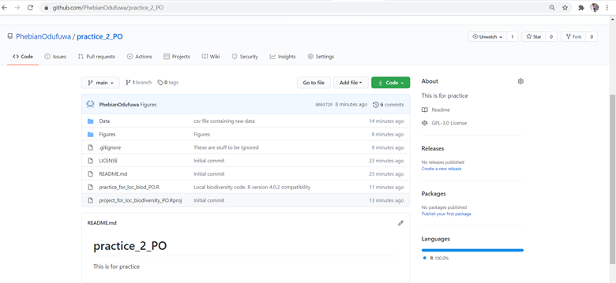
```

You are now done with your project. Close R Studio in preparation for the next stage!

In the next stage, you will be working as a collaborator, and not on your project anymore. 

# Collaborations and making changes to code

For collaborations, the first step is to give access to collaborators using either their username or email address. To do this; 

1. Go to your GitHub repository, click on your repository (i.e. the repository you need collaboration on)

2. Go to **'settings'**, click on **'manage access'**, GitHub will prompt you for your login password, once you enter your password,
click on **'Invite a collaborator'**

3. Enter the details of your collaborator, and send the invite

4. The collaborator will be nudged via email; once the collaborator accepts your invite to collaborate on the repository, you can now collaborate on the repository (or project).

See the figure below:

```{r, echo=FALSE, fig.align="center", fig.cap="Screen capture showing how to add collaborators on GitHub", out.width = '100%'}
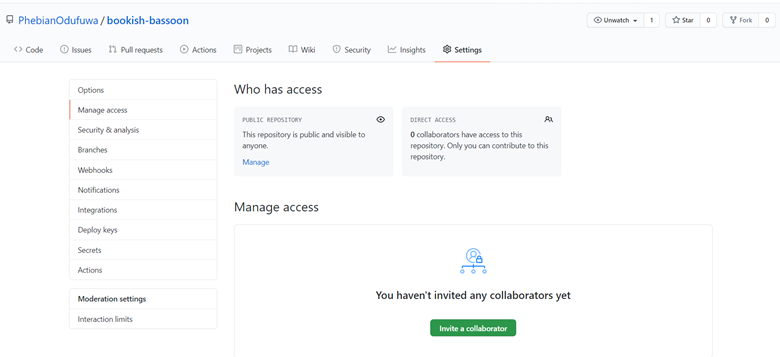
```

(In your own case, enter the username of your group collaborator as provided in the file entitled **'GitTutorial_2_Collaborations Group'** on [our](https://docs.google.com/spreadsheets/d/1lBr0cvgXq9ok27za5EARbByeEeZILXQW/edit#gid=1729631212) Google drive, and grant them access to your repository)


**To make changes to an existing code as a collaborator, it is best to follow these steps:**

1. Clone the repository into your local computer by doing the following: 
  - Copy the URL of the repository you are collaborating on.
  - Open R Studio, and click on 'Terminal', 
  - For the purpose of this exercise, we will be cloning our repository to Desktop; to change out of your previous directory, using the terminal, do;
  
```{bash, eval=FALSE, include=TRUE}
cd ~/Desktop
```
  
  - Clone the repository to Desktop by doing;
  
```{bash, eval=FALSE, include=TRUE}
# paste the url by right clicking and pressing 'paste'
git clone <paste the repository url>
```

  - By typing
  
```{bash, eval=FALSE, include=TRUE}
ls
```
  
  you should now be able to see your cloned repository on your Desktop.
  
Now that you have the repository cloned into your local computer, you are now ready to make changes to the code as a collaborator.

### Best Practice for effective collaboration:

By now you understand that git saves each version of your project as a snapshot of the code exactly as it was at the moment you committed it. Essentially creating a timeline of versions of a project as it progresses, so that you can roll back to an earlier version in the event disaster strikes.

The way git, and GitHub, manage this timeline — especially when more than one person is working in the project and making changes — is by using branches. A branch is essentially a unique set of code changes with a unique name. Each repository can have one or more branches. The main branch — the one where all changes eventually get merged back into, and is called master. This is the official working version of your project, and the one you see when you visit the project repository at **github.com/yourname/projectname**.

Do not mess with the master. If you make changes to the master branch of a group project while other people are also working on it, this could spell, well in one word - doom! In other words, do not mess with the master!

Instead, everyone uses branches created from master to experiment, make edits and additions and changes, before eventually rolling that branch back into the master once they have been approved and are known to work. Master then is updated to contain all the new stuff.

**Note:** A well commented code is very important to you as a collaborator, and to others who will want to use the code. Therefore, for all the commits you will be making, ensure that they are properly commented.

2. To begin working on anything new in a project, or to change existing things, you create a branch off the stable master branch. 

(a) you need to change to the newly cloned repository

```{bash, eval=FALSE, include=TRUE}
cd practice_2_yourcollaboratorinitials
```


(b) Prior to creating new branches, we want to check for any other existing branches. We know about the master, but who knows what other project collaborators may be up to? We can view all existing branches by typing 

```{bash, eval=FALSE, include=TRUE}
git branch -a
```

into terminal, which tells git that we want to see ALL the branches in this project, even ones that are not in our local workspace.

(c) To create this new branch type “git checkout -b branchNameHere” (in our case, we will call the branch name "betabiodiv_**yourinitials**")

```{bash, eval=FALSE, include=TRUE}
git checkout -b betabiodiv_yourinitials
```

This command creates a new branch and changes to the new branch automatically.
You can now see that you are no longer on the main or master, you are now on the branch you created

**Note:** To see the log of ALL that you are doing, type

```{bash, eval=FALSE, include=TRUE}
git log --oneline
```

This opens the log of your file, and shows you where you are currently at (not that this isn't obvious, but just to make double sure that you are on the branch you created and not on the main file!)

(d) Open the code to be made changes to on visual studio (visual studio code is a text editor that allows you to easily make changes to code, although it can be used for much more, but that will not be discussed in this class).

To open, visual studio code, type 

```{bash, eval=FALSE, include=TRUE}
code .
```


## Make changes to code as a Collaborator

The repository you want to work on is now opened in visual studio code from the new branch you created, and you are now ready to make changes to code.

**Instruction:**

**Step 1:** Click on the script you want to work on

**Step 2:** Copy the function we already created (from our R markdown file entitled **"Chapter_11_part2.Rmd"**), and paste at the bottom of previous code.

**Hypothetically speaking**, you as a collaborator feels there is a need to measure the beta diversity for the project you are collaborating on, so, you are updating the code with this function:

```{r betadiversity_code, eval = FALSE, out.width='100%'}
#### Measures of beta diversity 
### NMDS First using Bray-Curtis

## set a seed to make the results reproducible
set.seed(2)
dat.bc.nmds <- metaMDS(datt, k=2, trymax=100) ### Bray-Curtis is the default metric, 
### k = 2 dimensions

ordiplot(dat.bc.nmds, type = "t",display = "sites") ## Plot that shows names

stressplot(dat.bc.nmds) 
## optional, this just shows how your dissimilarity fits with ordination distance

## Now using the binary version of Jaccard
dat.jb.nmds <- metaMDS(datt, k=2, trymax=100, distance= "jaccard", binary=T) 

ordiplot(dat.jb.nmds, type = "t",display = "sites") 
## you can use cex = 0.6 to make text smaller

## Why do we see quadrants collapsing into each other?

stressplot(dat.jb.nmds) 
## optional, this just shows how your dissimilarity fits with ordination distance
```

**Step 3:** Save the changes you made, by typing 'ctrl+s'

**Step 4:** Navigate to R Terminal, commit changes, and upload to GitHub by doing:

- Save the change you made to the code, by typing:

```{bash, eval=FALSE, include=TRUE}
git add local_biodiv_practice_yourcollaboratorinitials.R
```

- Commit changes, by typing the command: git commit -m "comment (in branchName)", thus: 

```{bash, eval=FALSE, include=TRUE}
git commit -m "yourinitials adding this code to the initial code to measure beta biodiversity (in betabiodiv_yourinitials)"
```

- Push your branch "betabiodiv_**yourinitials**" with the edited code to GitHub by typing

```{bash, eval=FALSE, include=TRUE}
git push --set-upstream origin betabiodiv_yourinitials
```

- Go to your GitHub page, and click on your own repository (that is the repository name with **yourinitials**), you can now see that the branch (created by your collaborator) has been added.

\newpage

# Merging branches to the main repository

**Remember that you are now working from your repository**

We will now look at how to merge branches into the main repository. To merge the two separate branches as one, you will go back to your R terminal and follow these steps:

**Step 1:** From your project repository, bring in the changes and test.

```{bash, eval=FALSE, include=TRUE}
git fetch origin
```

```{bash, eval=FALSE, include=TRUE}
git checkout -b betabiodiv_yourcollaboratorinitials origin/betabiodiv_yourcollaboratorinitials
```

```{bash, eval=FALSE, include=TRUE}
git merge main
```


**Step 2:** Merge the changes and update on GitHub.

```{bash, eval=FALSE, include=TRUE}
git checkout main
```

```{bash, eval=FALSE, include=TRUE}
git merge --no-ff betabiodiv_yourcollaboratorinitials
```

```{bash, eval=FALSE, include=TRUE}
git push origin main
```


**Step 3:** Go to GitHub, you should now see that the changes made by your collaborator have now been merged to your main branch. See screenshot below:

```{r, echo=FALSE, fig.align="center", fig.cap="Screen capture showing merges", out.width = '100%'}
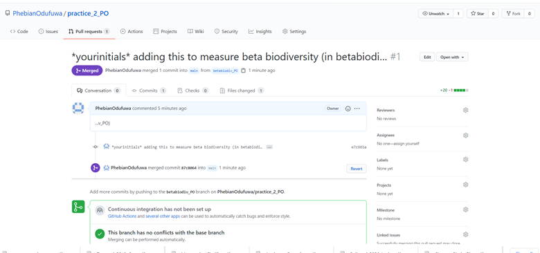
```

\newpage

# Cleaning up data

Once you have merged your branches, the next thing is to delete extra branch(es). To delete extraneous branch(es) from GitHub, 

- From main repository, click on **'branch'** 
- Select the branch you want to delete
- Click on the **delete icon** in front of the selected branch
- Navigate to **'Main'** and you can now see that the additional branch has been deleted.


# Organizing your data

It is important that your description is well laid out. So write a description that gives an overview of your project.
By scrolling to **"About"** and clicking on the **cogwheel symbol** on GitHub, type in a concise description. See the screenshot below

```{r, echo=FALSE, fig.align="center", fig.cap="Screen capture showing how to add description to your project on GitHub", out.width = '100%'}
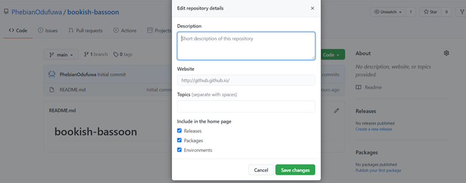
```

## Adding README and wiki

README files are a quick and simple way for other users to learn more about your work. Wikis on GitHub help you present in-depth information about your project in a useful way. To find out more about wiki <https://docs.github.com/en/free-pro-team@latest/github/building-a-strong-community/adding-or-editing-wiki-pages>

Adding README and wiki follows the same process as above:
see our README page [here](https://github.com/PhebianOdufuwa/GitHub_Tutorial_Day_1/blob/main/README.md) and our wiki page [here](https://github.com/PhebianOdufuwa/GitTutorial_2/wiki) 

### Commiting your document as a GitHub page

GitHub Pages are public webpages hosted and easily published through GitHub. See <https://guides.github.com/features/pages> for more information.

For this class, we will be using the "Documentation.html" which you have committed to GitHub, as an example.

- Click on Settings
- Scroll down to the 'GitHub Pages' tab and follow the instruction. We will do this together in class.

\newpage

# Conclusion  

Thanks for your attention throughout the tutorial. There are so many cool things you can do with Git and GitHub, we wish we had more time to show you. Luckily, there are excellent online tutorials attached below that we highly recommend you watch if you want to learn more.There is also a really awesome cheat sheet for Git commands [here](https://gist.github.com/cferdinandi/ef665330286fd5d7127d). 

**More about version control with Rstudio:**  
```{r, video1, echo=FALSE, message=FALSE}

library(vembedr)

embed_url("https://www.youtube.com/watch?v=kL6L2MNqPHg")
```


**A nice overview of Git and GitHub:**
```{r video2, echo=FALSE}
embed_url("https://www.youtube.com/watch?v=RGOj5yH7evk")
```


**A quick intro to Git:**
```{r video3, echo=FALSE}
embed_url("https://www.youtube.com/watch?v=USjZcfj8yxE")
```


**More useful Git basics:**
```{r video4, echo=FALSE}
embed_url("https://www.youtube.com/watch?v=HVsySz-h9r4")
```


# References

[1] Gandrud, C.. 2015. Reproducible research with R and RStudio. 2nd ed. CRC Press, Taylor & Francis Group, Boca Raton.Anon.

[2] Anon. git-help Documentation. Git. Available at: https://git-scm.com/docs/git-help [Accessed November 4, 2020].

[3] Anon. Hello World. Hello World · GitHub Guides. Available at: https://guides.github.com/activities/hello-world/#commit [Accessed November 4, 2020].

[4] Jenny Bryan, the S.T.A.T.545 T.A.. Happy Git and GitHub for the useR. A The shell. Available at: https://happygitwithr.com/shell.html#shell [Accessed November 4, 2020].

[5] Jenny Bryan, the S.T.A.T.545 T.A.. Happy Git and GitHub for the useR. Chapter 9 Connect to GitHub. Available at: https://happygitwithr.com/push-pull-github.html#push-pull-github [Accessed November 4, 2020].

[6] Jenny Bryan, the S.T.A.T.545 T.A.. Happy Git and GitHub for the useR. Chapter 7 Introduce yourself to Git. Available at: https://happygitwithr.com/hello-git.html [Accessed November 4, 2020].

[7] Anon. SSH Keys for GitHub. Available at: https://jdblischak.github.io/2014-09-18-chicago/novice/git/05-sshkeys.html [Accessed November 4, 2020].


<div id="refs"></div>

# Appendix 1

Citations of all R packages used to generate this report. 

```{r generateBibliography, results="asis", echo=FALSE, warning = FALSE, message=FALSE}
library("knitcitations")
cleanbib()
options("citation_format" = "pandoc")
read.bibtex(file = "packagesch11.bib")
``` 

# Appendix 2

Version information about R, the operating system (OS) and attached or R loaded packages. This appendix was generated using `sessionInfo()`.

```{r eval=T, echo=F, warning = FALSE, message=FALSE}
sessionInfo()
```

