```{r setup, include=FALSE}
knitr::opts_chunk$set(fig.pos = 'H')
```

```{r}
# Packages needed
library(knitr)
library(rmarkdown)
library(bookdown)
library(htmltools)
# Packages for publishing
library(packrat)
library(rsconnect)
```


# Site

According to the Harris Ranch Wildlife Impact Assessment and Management Plan (2007) the Harris family began their legacy in Idaho back in the 1950’s in the lumber industry.  Shortly after moving to what is known as east Boise, they began ranching in Barber Valley.  The family owned a significant portion of rangeland including portions in the foothills down to the Boise River.  As early as 1976 (Harris Ranch Specific Plan, 2019), the Harris family had a vision to develop the area into a planned community that considered ecology in their development.  As such, there have been extensive studies of the area outlining both existing conditions and recommendations for development.  

*Choosing the area was two-fold;* 

1. We are very interested in the ecology of the built environment 
2. Proximity.

The area was just south of Ann's house in a transition zone between existing development and future development. In the 2007 study, the land where Ann conducted her studies was considered as being in “poor condition” and where the “Native stand composition, structure, and function are significantly altered. Re-establishment of native stand composition, structure and function will require large energy inputs.” (Harris Ranch Wildlife Impact Assessment and Management Plan, 2007)  In the last few years Ann has watched it turn from pastures where cattle have grazed to being scraped bare by heavy equipment, preparing for development.  In just a short amount of time, plants and animals have begun to repopulate the area.  We wanted to see how much species diversity there is during the human development process.


```{r Quadrant1, echo=FALSE, fig.align="center", fig.cap="Quadrant 1", out.width = '60%'}
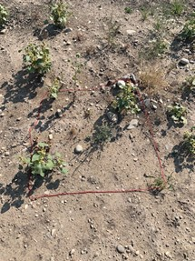
```


```{r Quadrant2, echo=FALSE, fig.align="center", fig.cap="Quadrant 2", out.width = '60%'}
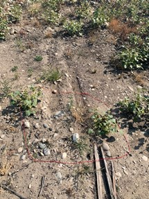
```


```{r Quadrant3, echo=FALSE, fig.align="center", fig.cap="Quadrant 3", out.width = '60%'}
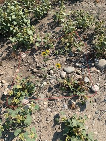
```


```{r Quadrant4, echo=FALSE, fig.align="center", fig.cap="Quadrant 4", out.width = '60%'}
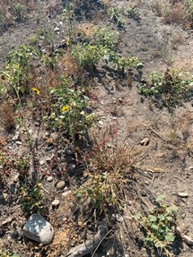
```


```{r Quadrant5, echo=FALSE, fig.align="center", fig.cap="Quadrant 5", out.width = '60%'}
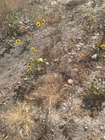
```

```{r Quadrant6, echo=FALSE, fig.align="center", fig.cap="Quadrant 6", out.width = '60%'}
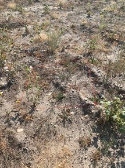
```


# RESULTS

```{r Species-Individual Curve Plot, echo=FALSE, fig.align="center", fig.cap="Species-Individual Curve Plot", out.width = '60%'}
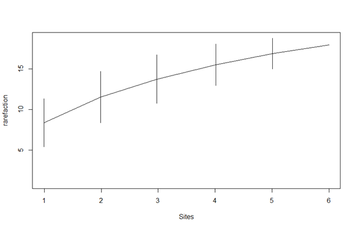
```


```{r Number of Species by Quadrant Plot, echo=FALSE, fig.align="center", fig.cap="Number of Species by Quadrant Plot", out.width = '60%'}
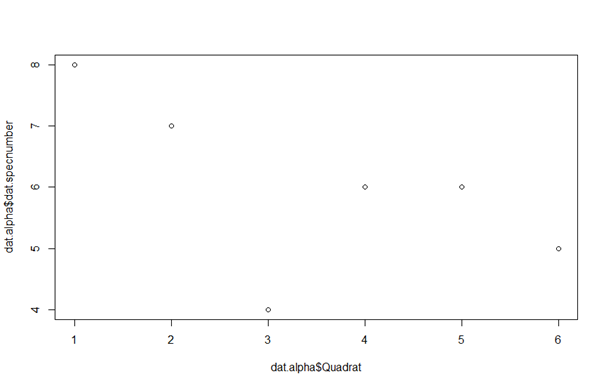
```


```{r, echo=FALSE, fig.align="center", fig.cap="Species Number Plot, Shannon Diversity Plot, Effective No. of Species Plot", out.width = '60%'}
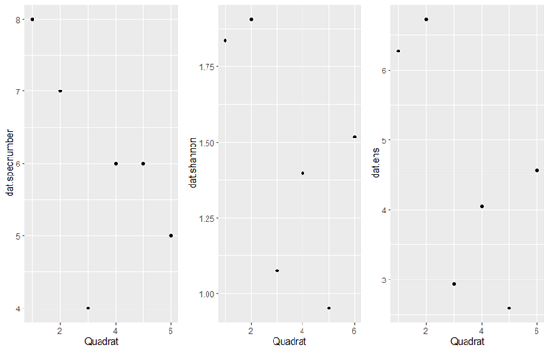
```


```{r, echo=FALSE, fig.align="center", out.width = '80%'}
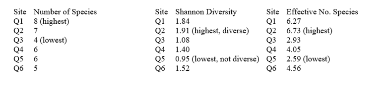
```


```{r, echo=FALSE, fig.align="center", fig.cap="NMDS Plot", out.width = '60%'}
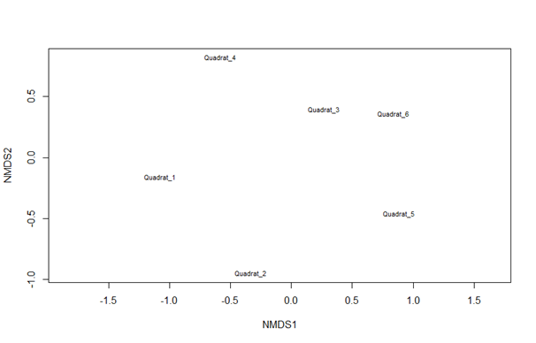

```

# SUMMARY

## Alpha Diversity

Alpha diversity may be determined by richness (number of species), evenness (relative abundance or distribution) or both.  

Simply looking at species richness in determining alpha diversity, quadrant 1 had the highest number of species at 8.  

Taking into account Shannon diversity and the effective number of species, quadrant 2 had the highest number of species and quadrant 5 had the lowest number of species.

## Beta Diversity

Beta diversity looks at the change in diversity across sites.  In NMDS plots, the higher the percentage, the more similar the quadrants.  After running the NMDS plots, all quadrants were close to zero, likely due to a small sample size.  Similarly, we see that the NMDS stress plot did not converge, likely due to a small sample size.  Since stress is almost zero and there is no convergence, I would conclude that there is not enough data to determine beta diversity.

# General Observations

The most difficult part of the project was remembering the species between quadrants.  Ann took samples and drew sketches of the species, but remembering them from one quadrant to the other was difficult.

Although quadrant 1 had the highest number of species, the total count of organisms was the third lowest.  It was also the only quadrant that we could see an animal of any kind.  It was a very small green insect.  This makes us want to do further studies on perturbed environments from human development and how it impacts animals.

Quadrant 5 surprised me in a few different ways.  On the onset, it looked very diverse, but had almost the smallest number of species.  Although it did not look like one species was dominating the quadrant, one species occurred 47 times in the quadrant, the most of all of the quadrants.  Perhaps there is a similar correlation to space availability as seen in Paine’s starfish experiments.  It would be interesting to see what happens if those plants were pulled out, allowing more room for other species to take hold.

Overall, We were amazed to see how many species returned so quickly in an area that has been scraped for development.  Acknowledging that this survey was done in the middle of the site development process, it would have been interesting to compare surveys before, during, after development, and maybe even post-mortem development.
